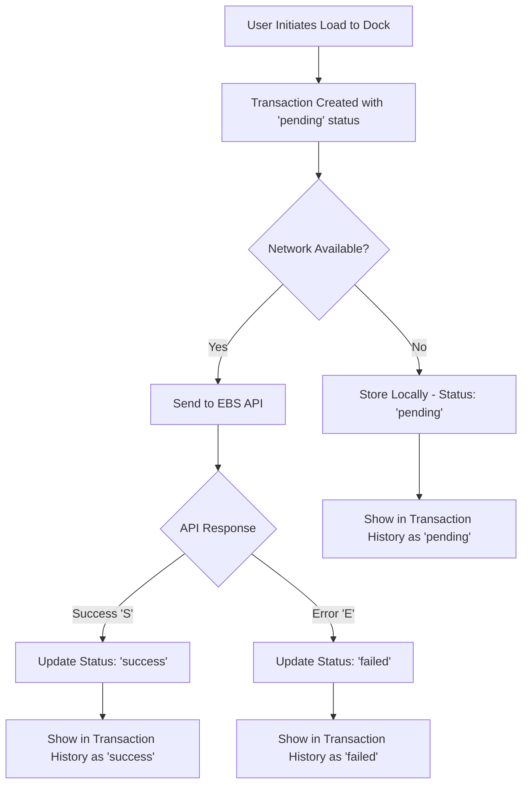

# 📊 Transaction History Implementation

This document describes the comprehensive Transaction History feature implementation for the Load to Dock functionality, providing complete visibility into transaction states and details.

## 🎯 Overview

The Transaction History page provides users with a complete view of all transactions performed through the Load to Dock POST API, with clear status indicators and detailed transaction information.

## 🏗️ Architecture

### Core Components

#### 1. **TransactionHistoryScreen** (`src/screen/TransactionHistoryScreen.tsx`)
- **Main transaction history interface** with filtering and status management
- **Real-time status updates** with pull-to-refresh functionality
- **Status-based filtering** (All, Pending, Success, Failed)
- **Responsive design** with proper safe area handling

#### 2. **LoadToDockService** (`src/services/loadToDockService.ts`)
- **Transaction data management** with comprehensive CRUD operations
- **Status tracking** with real-time updates
- **Database integration** for transaction persistence
- **API integration** for EBS transaction processing

#### 3. **Database Schema** (`src/constants/queries.ts`)
- **Transaction history table** with comprehensive fields
- **Status tracking** with timestamps and messages
- **Optimized queries** for filtering and pagination

## 📱 User Interface

### Transaction Status Cards

#### **Pending Transactions**
- **Visual Indicator**: Yellow badge with animated dot
- **Status Message**: "Transaction is being processed..."
- **Clear Indication**: Users understand the transaction is in progress

#### **Success Transactions**
- **Visual Indicator**: Green badge with checkmark
- **Success Message**: "✓ Transaction completed successfully"
- **Additional Details**: EBS response messages when available

#### **Failed Transactions**
- **Visual Indicator**: Red badge with error icon
- **Error Message**: "✗ Transaction failed"
- **Error Details**: Specific failure reasons from EBS API

### Filter System

#### **Status Filters**
- **All**: Shows all transactions (default view)
- **Pending**: Shows only pending transactions
- **Success**: Shows only successful transactions
- **Failed**: Shows only failed transactions

#### **Filter Features**
- **Count Badges**: Each filter shows the number of transactions
- **Active State**: Clear visual indication of selected filter
- **Horizontal Scroll**: Smooth navigation between filters

## 🔧 Technical Implementation

### Database Schema

```sql
CREATE TABLE load_to_dock_transaction_history (
    MobileTransactionId TEXT PRIMARY KEY,
    TransactionDate TEXT NOT NULL,
    DeliveryLineId TEXT NOT NULL,
    VehicleNumber TEXT NOT NULL,
    DockDoor TEXT NOT NULL,
    LpnNumber TEXT NOT NULL,
    InventoryOrgId TEXT NOT NULL,
    UserId INTEGER NOT NULL,
    ResponsibilityId TEXT NOT NULL,
    ItemsData TEXT NOT NULL,
    EBSTransactionStatus TEXT DEFAULT 'pending',
    sharePointTransactionStatus TEXT DEFAULT 'pending',
    CreatedAt TEXT NOT NULL,
    Message TEXT
);
```

### Transaction Status Flow



### Service Methods

#### **Transaction Retrieval**
```typescript
// Get all transactions
async getAllTransactions(): Promise<ILoadToDockTransactionRequest[]>

// Get transactions by status
async getTransactionsByStatus(status: 'pending' | 'success' | 'failed'): Promise<ILoadToDockTransactionRequest[]>

// Get paginated transactions
async getTransactionsPaginated(page: number, pageSize: number): Promise<ILoadToDockTransactionRequest[]>
```

#### **Status Management**
```typescript
// Update transaction status after API response
private async updateTransactionStatus(response: LoadToDockTransactionResponse[]): Promise<void>

// Get pending transactions for retry
async getPendingLoadToDockTransactions(): Promise<any[]>
```

## 🎨 UI Components

### Transaction Card Structure

```typescript
interface TransactionCard {
  // Header Section
  transactionId: string;
  timestamp: string;
  status: 'pending' | 'success' | 'failed';
  
  // Details Section
  deliveryLineId: string;
  vehicleNumber: string;
  dockDoor: string;
  lpnNumber: string;
  
  // Status-specific Content
  statusMessage?: string;
  errorDetails?: string;
}
```

### Status Indicators

#### **Pending Status**
- **Color Scheme**: Yellow/Amber (`#f59e0b`)
- **Icon**: Animated dot
- **Message**: Processing indication

#### **Success Status**
- **Color Scheme**: Green (`#10b981`)
- **Icon**: Checkmark
- **Message**: Success confirmation

#### **Failed Status**
- **Color Scheme**: Red (`#ef4444`)
- **Icon**: Error symbol
- **Message**: Error details

## 📊 Data Flow

### 1. **Transaction Creation**
```typescript
// When user completes Load to Dock
const request: LoadToDockRequest = {
  vehicleNumber: 'TRUCK001',
  dockDoor: 'DOCK001',
  inventoryOrgId: 'ORG123',
  userId: 1001,
  responsibilityId: 'RESP001',
  items: [/* item details */]
};

// Store in database with 'pending' status
await loadToDockService.processLoadToDock(request);
```

### 2. **Status Updates**
```typescript
// After EBS API response
const response: LoadToDockTransactionResponse = {
  MobileTransactionId: 12345,
  ReturnStatus: 'S', // or 'E' for error
  ReturnMessage: 'Transaction completed successfully'
};

// Update status in database
await loadToDockService.updateTransactionStatus([response]);
```

### 3. **Display in History**
```typescript
// Load transactions for display
const transactions = await loadToDockService.getAllTransactions();

// Filter by status
const pendingTransactions = transactions.filter(t => t.EBSTransactionStatus === 'pending');
```

## 🔄 Real-time Updates

### Pull-to-Refresh
- **Manual Refresh**: Users can pull down to refresh transaction list
- **Automatic Updates**: Status changes are reflected immediately
- **Loading States**: Clear indication during data loading

### Status Synchronization
- **Background Sync**: Pending transactions are retried when online
- **Status Updates**: Real-time status changes from API responses
- **Error Handling**: Failed transactions show detailed error messages

## 🎯 User Experience

### Clear Status Visibility
- **Immediate Feedback**: Users see transaction status immediately
- **Progress Indication**: Pending transactions show processing state
- **Error Clarity**: Failed transactions display specific error reasons

### Intuitive Navigation
- **Filter System**: Easy switching between transaction statuses
- **Count Badges**: Quick overview of transaction distribution
- **Responsive Design**: Works seamlessly across different screen sizes

### Comprehensive Information
- **Transaction Details**: All relevant transaction information displayed
- **Timestamps**: Clear indication of when transactions occurred
- **Status Messages**: Detailed success/error messages from EBS

## 🚀 Future Enhancements

### Planned Features
- **Retry Functionality**: Manual retry for failed transactions
- **Export Capability**: Export transaction history to CSV/PDF
- **Advanced Filtering**: Filter by date range, user, or delivery ID
- **Push Notifications**: Real-time status update notifications

### Performance Optimizations
- **Pagination**: Load transactions in batches for better performance
- **Caching**: Cache transaction data for faster loading
- **Background Sync**: Automatic retry of failed transactions

## 📝 Usage Examples

### Basic Transaction History View
```typescript
// Navigate to Transaction History
navigation.navigate('TransactionHistory');

// The screen automatically loads all transactions
// Users can filter by status using the filter buttons
```

### Filtering Transactions
```typescript
// Filter by status
const pendingTransactions = await loadToDockService.getTransactionsByStatus('pending');
const failedTransactions = await loadToDockService.getTransactionsByStatus('failed');
```

### Refresh Transaction List
```typescript
// Manual refresh
const handleRefresh = async () => {
  setIsRefreshing(true);
  await loadTransactions();
  setIsRefreshing(false);
};
```

## 🔧 Configuration

### Status Colors
```typescript
const statusColors = {
  pending: '#f59e0b',  // Amber
  success: '#10b981',  // Green
  failed: '#ef4444'    // Red
};
```

### Transaction Display Format
```typescript
const formatTimestamp = (timestamp: string): string => {
  const date = new Date(timestamp);
  return date.toLocaleString('en-US', {
    year: 'numeric',
    month: 'short',
    day: 'numeric',
    hour: '2-digit',
    minute: '2-digit',
    second: '2-digit'
  });
};
```

This implementation provides a comprehensive transaction history system that gives users complete visibility into their Load to Dock operations, with clear status indicators and detailed transaction information.
